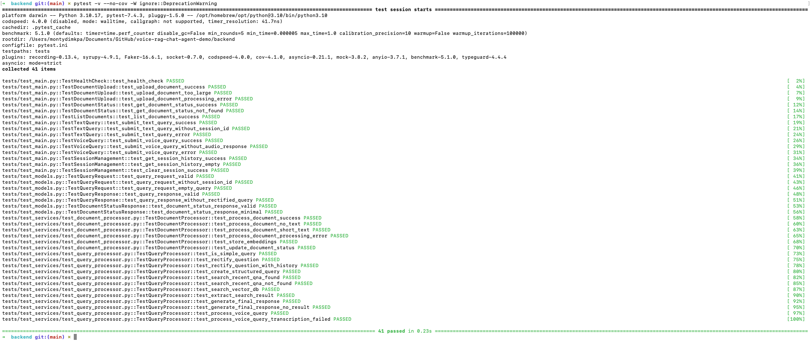
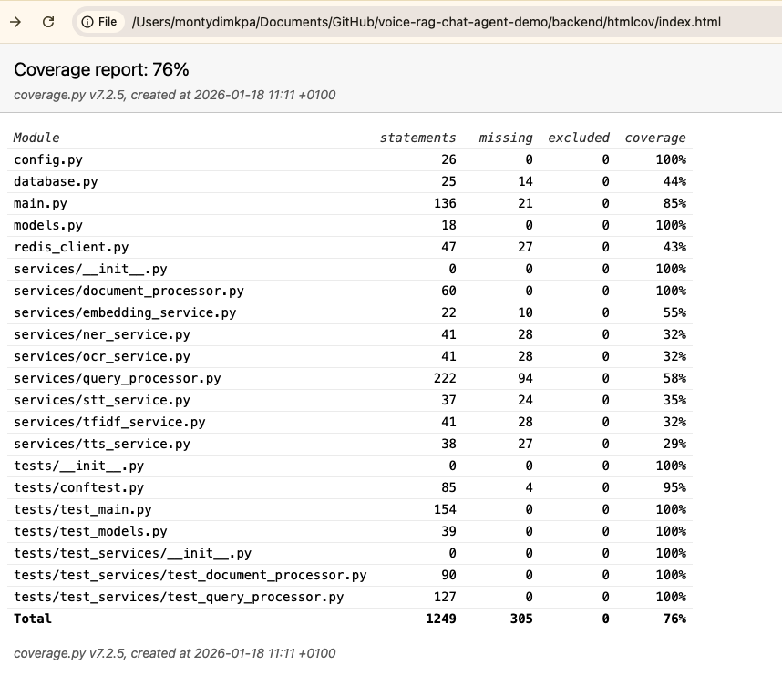
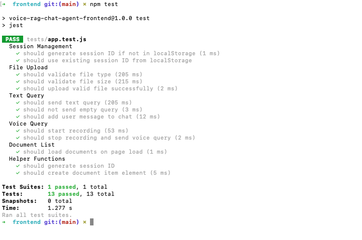

# Testing Guide

This document provides instructions for running tests in the Voice RAG Chat Agent project.

## Backend Tests

The backend uses **pytest** for testing. Tests are located in the `backend/tests/` directory.

### Setup

1. **Create and activate a virtual environment** (recommended):
```bash
cd backend

# Create virtual environment
python3 -m venv venv

# Activate virtual environment
# On macOS/Linux:
source venv/bin/activate
# On Windows:
# venv\Scripts\activate
```

2. **Install test dependencies**:
```bash
pip install -r requirements.txt
```

**Note:** The virtual environment should be activated whenever you run tests. You'll see `(venv)` in your terminal prompt when it's active.

### Running Tests

**Make sure your virtual environment is activated** (you should see `(venv)` in your terminal prompt).

Run all tests:
```bash
pytest
```

Run tests with coverage:
```bash
pytest --cov=. --cov-report=html
```

Run specific test file:
```bash
pytest tests/test_main.py
```

Run specific test class:
```bash
pytest tests/test_main.py::TestHealthCheck
```

Run tests with verbose output:
```bash
pytest -v
```

### Test Results

When all tests pass, you should see output similar to:



### Test Structure

- `tests/conftest.py` - Pytest fixtures and configuration
- `tests/test_main.py` - API endpoint tests
- `tests/test_models.py` - Pydantic model validation tests
- `tests/test_services/` - Service layer tests
  - `test_query_processor.py` - Query processing tests
  - `test_document_processor.py` - Document processing tests

### Test Coverage

The project includes coverage reporting. After running tests with coverage, you can view the HTML report:
```bash
open htmlcov/index.html  # macOS
# or
xdg-open htmlcov/index.html  # Linux
```

Example test coverage report:



## Frontend Tests

The frontend uses **Jest** for testing. Tests are located in the `frontend/tests/` directory.

### Setup

1. Install dependencies:
```bash
cd frontend
npm install
```

### Running Tests

Run all tests:
```bash
npm test
```

Run tests in watch mode:
```bash
npm run test:watch
```

Run tests with coverage:
```bash
npm run test:coverage
```

### Test Results

When all tests pass, you should see output similar to:



### Test Structure

- `tests/setup.js` - Jest configuration and mocks
- `tests/app.test.js` - Frontend application tests

### Test Coverage

Coverage reports are generated in the `coverage/` directory. View the HTML report:
```bash
open coverage/index.html  # macOS
# or
xdg-open coverage/index.html  # Linux
```

## Continuous Integration

To run all tests in CI/CD:

```bash
# Backend tests (CI typically handles venv setup automatically)
cd backend
python3 -m venv venv
source venv/bin/activate  # On Windows: venv\Scripts\activate
pip install -r requirements.txt
pytest --cov=. --cov-report=xml

# Frontend tests
cd frontend && npm test -- --coverage --ci
```

## Writing New Tests

### Backend

1. Create test files with `test_` prefix
2. Use pytest fixtures from `conftest.py`
3. Mock external dependencies (database, Redis, APIs)
4. Follow the existing test structure

Example:
```python
def test_my_function(client):
    response = client.get("/api/endpoint")
    assert response.status_code == 200
```

### Frontend

1. Create test files with `.test.js` extension
2. Use Jest mocks from `setup.js`
3. Test user interactions and API calls
4. Mock fetch and browser APIs

Example:
```javascript
test('should handle user action', async () => {
  fetch.mockResponseOnce(JSON.stringify({ data: 'test' }));
  // ... test code
  expect(fetch).toHaveBeenCalled();
});
```

## Notes

- **Virtual Environment**: Always use a virtual environment for backend tests to avoid dependency conflicts
- Backend tests use mocked database and Redis connections
- Frontend tests use jsdom for DOM simulation
- All external API calls are mocked in tests
- Tests should be fast and independent

### Deactivating Virtual Environment

When you're done working, you can deactivate the virtual environment:
```bash
deactivate
```
