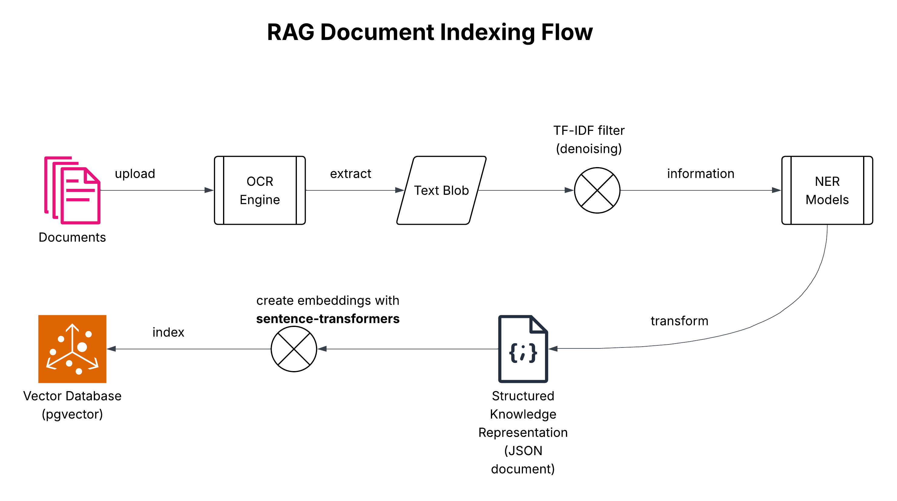

# System Design (Technical Specification) Document

## Overview

This document provides a comprehensive technical specification for two core sub-systems of the agentic platform:

1. **RAG Document Indexing System** - Processes and indexes documents for retrieval
2. **Voice/Text RAG Search System** - Handles user queries and retrieves relevant information

Both systems work together to enable intelligent document-based question answering with support for voice and text interactions.

---

## System 1: RAG Document Indexing Flow

### Purpose

The RAG Document Indexing System transforms raw documents into searchable vector embeddings stored in a vector database. This system prepares knowledge for efficient semantic search and retrieval.

### Architecture Flow



The system follows a sequential pipeline as illustrated in `rag-document-indexing.png`:

```
Documents → OCR Engine → Text Blob → TF-IDF Filter → NER Models → 
Structured Knowledge (JSON) → Sentence-Transformers Embeddings → Vector Database (pgvector)
```

### Component Specifications

#### 1. Document Ingestion

**Input:** Raw documents in various formats (PDF, images, scanned documents, etc.)

**Processing:**
- Accepts document uploads through an ingestion API
- Validates document format and size
- Supports batch processing for multiple documents
- Maintains document metadata (source, timestamp, format, etc.)

**Output:** Validated documents ready for OCR processing

**Technical Requirements:**
- Support for common document formats (PDF, PNG, JPG, TIFF, etc.)
- Maximum file size limits (configurable)
- Document validation and error handling
- Metadata extraction and storage

#### 2. OCR Engine (Optical Character Recognition)

**Purpose:** Extract text content from documents, especially scanned images and PDFs

**Input:** Raw documents (images, scanned PDFs, etc.)

**Processing:**
- Performs optical character recognition on document images
- Processes multi-page documents
- Handles various image qualities and orientations

**Output:** Raw text blob containing extracted text

**Technical Requirements:**
- OCR engine selection (Tesseract)
- Multi-page document handling
- Language detection and configuration
- Error handling for unreadable documents

**Performance Considerations:**
- Processing time scales with document size and complexity
- Batch processing capabilities for efficiency

#### 3. Text Blob

**Description:** Raw extracted text from OCR, typically unstructured and may contain noise

**Characteristics:**
- Unstructured text content
- May contain OCR errors and artifacts
- No semantic structure or formatting
- May include irrelevant content (headers, footers, watermarks, etc.)

#### 4. TF-IDF Filter (Denoising)

**Purpose:** Clean and filter the extracted text to remove noise and irrelevant content

**Input:** Raw text blob from OCR

**Processing:**
- Applies Term Frequency-Inverse Document Frequency (TF-IDF) analysis
- Identifies and removes low-value terms and noise
- Filters out common stop words and irrelevant patterns
- Removes OCR artifacts and formatting remnants
- Normalizes text (whitespace, encoding, etc.)

**Output:** Cleaned and filtered text information

**Technical Requirements:**
- TF-IDF algorithm implementation
- Stop word dictionary (English)
- Noise pattern detection and removal
- Text normalization utilities
- Configurable filtering thresholds

**Algorithm Details:**
- Calculate TF-IDF scores for terms across the document corpus
- Remove terms below a threshold TF-IDF score
- Preserve high-value content terms
- Maintain document structure where possible

#### 5. NER Models (Named Entity Recognition)

**Purpose:** Extract structured information from cleaned text by identifying entities and relationships

**Input:** Cleaned text information from TF-IDF filter

**Processing:**
- Identifies named entities (persons, organizations, locations, dates, etc.)
- Extracts relationships between entities
- Classifies entity types
- Handles multi-word entities and entity variations
- May use multiple NER models for different entity types

**Output:** Structured knowledge representation with identified entities and relationships

**Technical Requirements:**
- NER model selection (spaCy)
- Entity type taxonomy definition
- Relationship extraction capabilities
- Confidence scoring for entity recognition

**Entity Types Typically Extracted:**
- Person names
- Organization names
- Locations (geographic entities)
- Dates and temporal expressions
- Product names
- Technical terms
- Custom domain-specific entities

#### 6. Structured Knowledge Representation (JSON Document)

**Purpose:** Transform extracted entities and relationships into a machine-readable structured format

**Input:** Entity and relationship data from NER models

**Processing:**
- Structures entities with their types and attributes
- Captures relationships between entities
- Includes source document references
- Adds metadata (confidence scores, extraction timestamps, etc.)
- Validates JSON structure and schema

**Output:** JSON document containing structured knowledge

**JSON Schema Example:**
```json
{
  "document_id": "doc_12345",
  "source": "original_document.pdf",
  "extraction_timestamp": "2024-01-15T10:30:00Z",
  "entities": [
    {
      "text": "John Doe",
      "type": "PERSON",
      "start_char": 120,
      "end_char": 128,
      "confidence": 0.95
    },
    {
      "text": "Acme Corporation",
      "type": "ORGANIZATION",
      "start_char": 200,
      "end_char": 217,
      "confidence": 0.92
    }
  ],
  "relationships": [
    {
      "subject": "John Doe",
      "predicate": "works_at",
      "object": "Acme Corporation",
      "confidence": 0.88
    }
  ],
  "original_text_chunks": [
    {
      "chunk_id": "chunk_1",
      "text": "Full text content...",
      "entities_mentioned": ["John Doe", "Acme Corporation"]
    }
  ]
}
```

**Technical Requirements:**
- JSON schema definition and validation
- Consistent structure across all documents
- Metadata preservation

#### 7. Local Embedding Creation

**Purpose:** Convert structured knowledge into high-dimensional vector embeddings for semantic search

**Input:** Structured JSON document

**Processing:**
- Uses a local model (`sentence-transformers`) to generate embeddings
- Processes structured JSON content
- May combine entity information with original text chunks
- Generates dense vector representations (768 dimensions)
- Handles variable-length content through chunking if necessary

**Output:** Vector embeddings ready for indexing

**Technical Requirements:**
- Local embeddings generation (sentence-transformers)
- Embedding dimension configuration
- Batch processing capabilities
- Chunking strategy for large documents
- Embedding normalization (if required)

**Embedding Model Considerations:**
- Model size and performance trade-offs
- Semantic understanding capabilities
- Local processing eliminates API costs

#### 8. Vector Database (pgvector)

**Purpose:** Store and index vector embeddings for efficient similarity search

**Input:** Vector embeddings from local model

**Processing:**
- Stores embeddings in PostgreSQL with pgvector extension
- Creates vector indexes (HNSW) for fast similarity search
- Associates embeddings with metadata (document ID, chunk ID, entity information)
- Maintains referential integrity with original documents

**Output:** Indexed vectors in vector database

**Technical Requirements:**
- PostgreSQL database with pgvector extension
- Vector index type selection (HNSW recommended for production)
- Index configuration (dimensions, distance metric, index parameters)
- Metadata storage alongside vectors

**pgvector Configuration:**
- Vector dimension must match embedding model output
- Distance metric: cosine similarity, L2 distance, or inner product
- Index parameters: `m` (number of connections) and `ef_construction` for HNSW
- Query parameters: `ef_search` for search quality vs. speed trade-off

**Database Schema Example:**
```sql
CREATE TABLE document_embeddings (
    id SERIAL PRIMARY KEY,
    document_id VARCHAR(255) NOT NULL,
    chunk_id VARCHAR(255),
    embedding vector(768),
    metadata JSONB,
    created_at TIMESTAMP DEFAULT NOW()
);

CREATE INDEX ON document_embeddings 
USING hnsw (embedding vector_cosine_ops);
```

### Data Flow Summary

1. **Ingestion:** Documents are uploaded and validated
2. **Text Extraction:** OCR engine extracts raw text
3. **Preprocessing:** TF-IDF filter removes noise and irrelevant content
4. **Information Extraction:** NER models identify entities and relationships
5. **Structuring:** Data is transformed into structured JSON format
6. **Embedding:** Sentence-transformers creates vector representations
7. **Indexing:** Embeddings are stored in pgvector for retrieval

### Performance Characteristics

- **Throughput:** High throughput depending on document size and complexity
- **Latency:** End-to-end processing time is fast due to local embedding generation
- **Scalability:** Can process documents in parallel batches
- **Storage:** Vector database size grows with number of documents and chunks

---

## System 2: Voice/Text RAG Search

### Purpose

The Voice/Text RAG Search System processes user queries (voice or text), retrieves relevant information from indexed documents, and generates contextual responses. It supports multi-turn conversations and maintains session context.

### Architecture Flow


The system follows the workflow illustrated in `voice-text-rag-search.png`:

```
User Query (Voice/Text) → Local STT (if voice) → Question Rectification → 
Structured Query → Retrieval (Recent QnA / Vector DB) → Response Generation → 
Local TTS (if voice) → User Response
```

### Component Specifications

#### 1. User Input Processing

**Input Methods:**
- **Input Text:** Direct text queries from users
- **Record Audio:** Voice input that requires transcription

**Processing:**
- Accepts user queries through API endpoints
- Maintains session context (Session ID)
- Routes to appropriate processing pipeline based on input type
- Validates input format and length

**Output:** Text input ready for processing (either direct or transcribed)

**Technical Requirements:**
- RESTful API (FastAPI framework)
- Session management (session ID generation and tracking)
- Input validation and sanitization

#### 2. Speech-to-Text (STT) - Local Transcription

**Purpose:** Convert voice audio input into text using local transcription

**Input:** Audio recording from user

**Processing:**
- Uses local STT model (Whisper "small" model) for transcription
- Processes audio on-server without external API calls
- Handles WAV audio format and other common formats
- Supports English language only
- Advanced audio preprocessing:
  - Audio normalization to prevent clipping and improve recognition
  - Stereo-to-mono conversion (averages channels)
  - Automatic resampling to 16kHz (Whisper's expected sample rate)
  - Format conversion and quality optimization
- Uses fp32 precision for better accuracy (instead of fp16)
- Handles background noise and audio quality variations

**Output:** Transcribed text input

**Technical Requirements:**
- Local STT model (OpenAI Whisper "small" model - upgraded from "base" for better accuracy)
- Audio preprocessing libraries (soundfile, scipy) for normalization and resampling
- Fallback to basic transcription if preprocessing libraries unavailable
- Batch transcription mode
- Model loading and memory management

**Performance Considerations:**
- Latency depends on model size and hardware (small model: ~1-3 seconds for typical audio)
- Audio quality impact on accuracy (preprocessing improves results)
- Local processing eliminates API costs and network latency
- Model size vs. accuracy trade-offs (small model balances accuracy and speed)
- Memory requirements for model loading (~1GB for small model)
- Preprocessing adds minimal overhead (~50-100ms) but significantly improves accuracy

#### 3. Ephemeral Conversation History (Session ID)

**Purpose:** Maintain context for multi-turn conversations within a user session

**Storage:**
- Redis storage
- Keyed by Session ID
- TTL (Time-To-Live) for automatic expiration
- Stores conversation turns (questions and answers)

**Data Structure:**
```json
{
  "session_id": "sess_abc123",
  "created_at": "2024-01-15T10:00:00Z",
  "last_activity": "2024-01-15T10:15:00Z",
  "conversation_history": [
    {
      "turn": 1,
      "user_query": "What is the company policy?",
      "system_response": "The company policy states...",
      "timestamp": "2024-01-15T10:00:05Z"
    },
    {
      "turn": 2,
      "user_query": "Can you tell me more about that?",
      "system_response": "Certainly, here are more details...",
      "timestamp": "2024-01-15T10:01:20Z"
    }
  ],
  "recent_qna_pairs": [
    {
      "question": "What is the company policy?",
      "answer": "The company policy states...",
      "retrieved_at": "2024-01-15T10:00:05Z"
    }
  ]
}
```

**Technical Requirements:**
- Fast read/write access (low latency)
- Automatic expiration of old sessions
- Memory-efficient storage
- Session isolation and security
- Configurable history length limits

#### 4. Question Rectifier Prompt

**Purpose:** Refine and contextualize user queries using conversation history

**Input:**
- Current text input (from user or STT)
- Ephemeral conversation history (injected context)

**Processing:**
- **Smart Skip Logic**: For simple, clear queries (short, no pronouns, already formatted), skips LLM rectification to reduce latency (~1-2 seconds saved)
- For complex queries, constructs a prompt that includes:
  - Conversation history context
  - Current user query
  - Instructions for query clarification and contextualization
- Sends prompt to LLM for processing (only when needed)
- LLM generates a contextually-updated question that:
  - Resolves pronouns and references ("that", "it", "the previous topic")
  - Clarifies ambiguous queries
  - Incorporates context from previous turns
  - Maintains query intent while improving clarity

**Output:** Contextually-updated question

**Performance Optimization:**
- Simple queries (≤10 words, no pronouns, no history) skip LLM call entirely
- Reduces latency by 1-2 seconds for straightforward queries
- Maintains accuracy for complex queries requiring context resolution

**Prompt Template Example:**
```
You are a query rectification assistant. Given the conversation history and current query, 
generate a clear, contextually-aware question.

Conversation History:
{conversation_history}

Current User Query: {current_text_input}

Generate a refined question that:
1. Resolves any references to previous conversation
2. Clarifies ambiguous terms
3. Maintains the user's original intent
4. Is optimized for information retrieval

Refined Question:
```

**Technical Requirements:**
- LLM API integration (OpenAI GPT) for question rectification
- Prompt engineering and optimization
- Token limit management
- Response parsing and validation
- Error handling and fallback to original query

#### 5. NER Filter

**Purpose:** Extract key entities from the text input to enhance search precision

**Input:** rectified question text

**Processing:**
- Applies Named Entity Recognition to identify entities
- Extracts entity types relevant to the domain
- May use the same NER models as the indexing system for consistency
- Filters and prioritizes entities for search

**Output:** Extracted entities for structured query generation

**Technical Requirements:**
- NER model (consistent with indexing system)
- Entity extraction and filtering
- Entity type mapping
- Confidence scoring

#### 6. Structured Query Generation

**Purpose:** Combine rectified question and extracted entities into an optimized search query

**Input:**
- Contextually-updated question
- Extracted entities from NER filter

**Processing:**
- Combines question and entities
- Structures query for efficient retrieval
- May include query expansion or reformulation
- Prepares query for both semantic search and entity-based filtering

**Output:** Structured query ready for retrieval

**Query Structure Example:**
```json
{
  "rectified_question": "What is the company policy on remote work?",
  "entities": [
    {"text": "company policy", "type": "TOPIC"},
    {"text": "remote work", "type": "TOPIC"}
  ],
  "search_intent": "informational",
  "query_embedding_ready": true
}
```

#### 7. Recent QnA Pairs Cache

**Purpose:** Fast retrieval of recently accessed or frequently asked questions

**Storage:**
- Fast access storage (Redis)
- Keyed by question embeddings or question text
- Stores question-answer pairs with metadata
- Maintains recency and frequency metrics

**Data Structure:**
```json
{
  "question": "What is the company policy?",
  "answer": "The company policy states...",
  "question_embedding": [0.123, 0.456, ...],
  "source_document": "doc_12345",
  "last_accessed": "2024-01-15T10:00:05Z",
  "access_count": 15,
  "confidence": 0.95
}
```

**Retrieval Process:**
- Performs high-similarity search using question embedding
- Uses cosine similarity metric
- Returns cached answer if similarity exceeds threshold
- Updates access metadata

**Technical Requirements:**
- Vector similarity search in cache
- Configurable similarity threshold
- Cache eviction policies (LRU, time-based)
- Cache warming strategies
- Performance optimization for fast lookups

#### 8. High-Similarity Search Decision

**Purpose:** Determine if a match is found in recent QnA pairs

**Input:** Structured query and recent QnA pairs

**Processing:**
- Creates embedding for structured query (if not already created)
- Performs vector similarity search against recent QnA pairs
- Compares similarity score against threshold (e.g., 0.85)
- Makes binary decision: match found or not

**Output:** Boolean decision + extracted result (if match found)

**Technical Requirements:**
- Similarity threshold configuration
- Fast embedding generation using sentence-transformers
- Efficient vector search algorithm

#### 9. Vector Database Search (pgvector)

**Purpose:** Retrieve relevant document chunks from the vector database when cache miss occurs

**Input:** Structured query (with embedding)

**Processing:**
- Creates embedding for structured query using sentence-transformers (if not already created)
- Performs vector similarity search in pgvector database
- Retrieves top-k most similar document chunks
- Applies metadata filters (if any)
- Ranks results by similarity score

**Output:** Search results (document chunks with similarity scores)

**Technical Requirements:**
- pgvector query execution
- Similarity metric (cosine)
- Top-k retrieval (configurable k value)
- Metadata filtering capabilities
- Query performance optimization
- Query embedding generation using sentence-transformers (local)

**Query Example:**
```sql
SELECT 
    document_id,
    chunk_id,
    metadata,
    1 - (embedding <=> $1::vector) as similarity
FROM document_embeddings
WHERE 1 - (embedding <=> $1::vector) > 0.7
ORDER BY embedding <=> $1::vector
LIMIT 10;
```

#### 10. Result Found Decision

**Purpose:** Determine if relevant results were found in vector database

**Input:** Vector database search results

**Processing:**
- Checks if any results exceed similarity threshold
- Evaluates result quality and relevance
- Makes binary decision: result found or not

**Output:** Boolean decision + extracted results (if found)

**Fallback:** If no results found, generates canned off-topic response

#### 11. Canned Off-Topic Response

**Purpose:** Provide user-friendly response when no relevant information is found

**Content:** Pre-defined responses for out-of-scope queries

**Examples:**
- "I couldn't find relevant information about that topic in the available documents."
- "That question is outside the scope of the current knowledge base."
- "I don't have information about that. Could you rephrase your question?"

**Technical Requirements:**
- Configurable response templates
- Contextual variation to avoid repetition

#### 12. Result Extraction and Processing

**Purpose:** Extract and format search results for response generation

**Input:** Search results from recent QnA pairs or vector database

**Processing:**
- Extracts relevant text chunks
- Combines multiple chunks if needed
- Formats results with source citations
- Prepares context for response generation

**Output:** Resolved search result (text) ready for user

#### 13. Conversation History Update

**Purpose:** Update ephemeral conversation history and recent QnA pairs with new interaction

**Processing:**
- Adds new QnA pair to conversation history
- Updates recent QnA pairs cache with new question and answer
- Maintains history length limits
- Updates session metadata (last activity timestamp)

**Technical Requirements:**
- Atomic updates for consistency
- Efficient storage operations
- History pruning (remove old entries)
- Cache invalidation strategies

#### 14. Final Response Generation

**Purpose:** Generate natural language response from retrieved information

**Input:** Resolved search result (text)

**Processing:**
- Uses LLM to format retrieved information into coherent response

**Output:** Final response (text)

**Technical Requirements:**
- LLM-based response formatting logic
- Response length limits

#### 15. Text-to-Speech (TTS) Conversion - Local TTS

**Purpose:** Convert text response to audio for voice input users using local TTS

**Input:** Final response (text)

**Processing:**
- Converts text to speech audio using local TTS model
- Processes audio on-server without external API calls
- Uses optimized fast TTS model (glow-tts) for low latency
- Generates audio in appropriate format (WAV)

**Output:** Audio response

**Technical Requirements:**
- Local TTS model (Coqui TTS - glow-tts model for speed)
- Voice selection and configuration
- Audio format (WAV)
- Model loading and memory management
- Async processing via thread pool executor for non-blocking operation

**Performance Considerations:**
- **Optimized Model**: Uses glow-tts model (2-3x faster than tacotron2-DDC)
- **Latency**: ~6-8 seconds for typical responses (down from ~19-20 seconds)
- Audio quality remains natural and clear
- Local processing eliminates API costs and network latency
- Model size vs. quality trade-offs (glow-tts balances both)
- Memory requirements for model loading
- Processing runs in thread pool to avoid blocking other requests

#### 16. Response Delivery

**Purpose:** Deliver final response to user (text or audio)

**Processing:**
- Routes response based on original input type
- Delivers text response for text queries
- Delivers audio response for voice queries
- For audio responses, encodes query metadata (JSON) as base64 in HTTP headers to handle Unicode characters
- Handles delivery errors and retries

**Output:** Response displayed/played to user

**Technical Requirements:**
- API response formatting
- Base64 encoding for HTTP headers containing Unicode data (prevents latin-1 codec errors)
- Error handling and retry logic
- User feedback mechanisms
- Frontend decoding of base64-encoded metadata headers

### Data Flow Summary

1. **Input Processing:** User provides query (voice or text)
2. **Transcription:** Voice input converted to text via STT
3. **Contextualization:** Question rectified using conversation history
4. **Query Structuring:** NER extraction and structured query generation
5. **Primary Retrieval:** Search recent QnA pairs cache
6. **Secondary Retrieval:** If cache miss, search vector database
7. **Result Processing:** Extract and format search results
8. **History Update:** Update conversation history and cache
9. **Response Generation:** Create final response
10. **Output Conversion:** Convert to audio if needed (TTS)
11. **Delivery:** Send response to user

### Decision Points

1. **Match Found in Recent QnA?**
   - Yes → Extract recent search result
   - No → Proceed to vector database search

2. **Result Found in Vector DB?**
   - Yes → Extract search result
   - No → Generate canned off-topic response

3. **Audio Input?**
   - Yes → Convert response to audio via TTS
   - No → Return text response

### Performance Characteristics

- **Latency (Optimized):** 
  - Cache hit: < 100ms
  - Vector DB search: 100-500ms (optimized with single-query fallback)
  - Local STT: 0.5-3 seconds (depends on model and hardware)
  - Question rectification: 0-2 seconds (skipped for simple queries, ~1-2s for complex)
  - Local TTS: 6-8 seconds (optimized with glow-tts model, down from 19-20s)
  - End-to-end voice query: 15-18 seconds (down from 27-30s with optimizations)
  - End-to-end text query: 1-4 seconds (depending on path)
- **Throughput:** Handles concurrent user sessions via async processing and thread pool executor
- **Scalability:** Horizontal scaling through session distribution
- **Cache Hit Rate:** Target 30-50% for common queries
- **Optimization Features:**
  - Simple query detection skips LLM rectification (1-2s saved)
  - Fast TTS model (glow-tts) reduces synthesis time by 60%
  - Optimized vector search reduces fallback query attempts
  - Async processing prevents blocking during CPU-intensive operations

---

## System Integration

### Data Flow Between Systems

1. **Indexing → Search:** Vector embeddings created by indexing system are queried by search system
2. **Shared Components:** NER models used in both systems for consistency
3. **Metadata Consistency:** Document metadata maintained across both systems

### Shared Infrastructure

- **Vector Database (pgvector):** Used by both systems
- **Sentence-Transformers:** Used for embeddings generation in both systems
- **NER Models:** Shared entity recognition models (spaCy)
- **Session Storage:** Fast storage for conversation history
- **Local Models:** STT and TTS models run locally on shared infrastructure

### API Endpoints

**Indexing System:**
- `POST /api/documents/upload` - Upload documents for indexing
- `GET /api/documents/status/{document_id}` - Check indexing status
- `GET /api/documents` - List indexed documents

**Search System:**
- `POST /api/query` - Submit text query
- `POST /api/query/voice` - Submit voice query
- `GET /api/session/{session_id}/history` - Get conversation history
- `DELETE /api/session/{session_id}` - Clear session

---

## Technology Stack

### Core Technologies

- **Vector Database:** PostgreSQL with pgvector extension
- **Embeddings:** sentence-transformers (local)
- **OCR:** Tesseract (local)
- **STT:** Local transcription (OpenAI Whisper "small" model)
- **TTS:** Local TTS (Coqui TTS - glow-tts model for optimized latency)
- **NER:** spaCy (local)
- **Caching:** Redis for session and QnA cache
- **API Framework:** FastAPI
- **Audio Processing:** soundfile, scipy (for STT preprocessing)

### Infrastructure

- **Containerization:** Docker for deployment
- **Orchestration:** Docker-compose
- **Database:** PostgreSQL with pgvector
- **Local Model Storage:** Models stored locally (STT, TTS, sentence-transformers)

### Local Processing Benefits

- **Cost Efficiency:** No per-request API costs for STT, TTS, and embeddings
- **Privacy:** All processing happens locally, no data sent to external services
- **Latency:** Reduced network latency for model inference
- **Data Control:** Complete control over data processing and storage
- **Scalability:** Predictable costs without usage-based pricing

---

## Appendix

### Glossary

- **RAG:** Retrieval-Augmented Generation
- **OCR:** Optical Character Recognition
- **NER:** Named Entity Recognition
- **TF-IDF:** Term Frequency-Inverse Document Frequency
- **STT:** Speech-to-Text
- **TTS:** Text-to-Speech
- **pgvector:** PostgreSQL extension for vector similarity search
- **HNSW:** Hierarchical Navigable Small World (vector index algorithm)
- **QnA:** Question and Answer

### References

- Architecture diagrams: `docs/rag-document-indexing.png`, `docs/voice-text-rag-search.png`
- pgvector documentation: https://github.com/pgvector/pgvector
